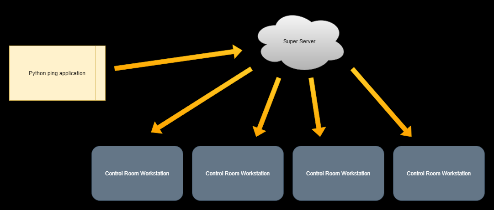
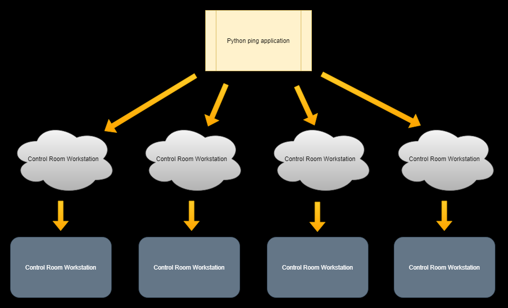
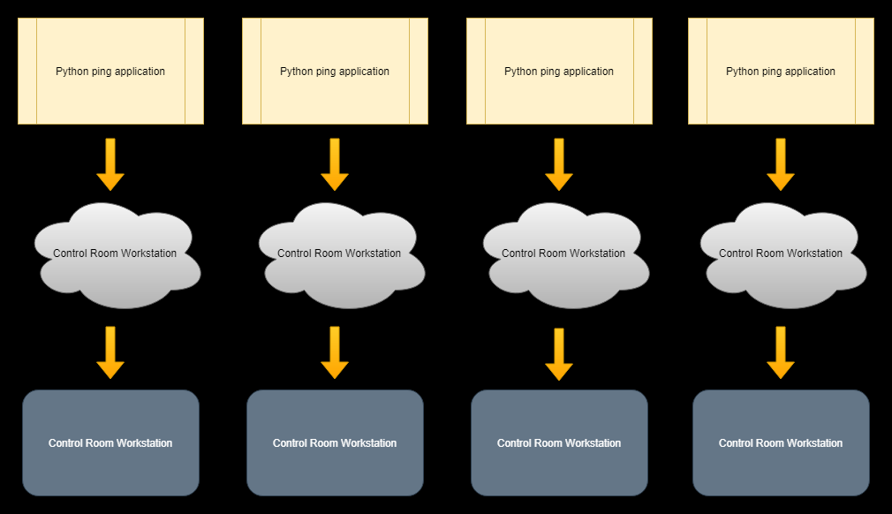

# **Architecture Options**

## **Option 1 (Centralized on super server)**

### **Synopsis**

The python script for uptime data is run as a service on one of the workstations. The prometheus configuration file on the super server is changed to add the HTTP server created by the python script as a target. Then, each of the workstations must add the super server as a datasource and will each query the super server for up/down information.

### **Tradeoffs**

This architecture relies on both the python script run as a service always being up, as well as the prometheus server run on the super server always being online. If either crashes or breaks, no up/down information will be available to any workstation.  

### **Implementation Needs**

Two things are needed to implement this approach. The first thing needed is to configure the config.yaml file on the super server to add the HTTP server to the scrape targets. Second, run the python program as a service on one of the workstations. After those two steps are done, the workstations must have the super server datasource added to them. From there, the data should be accessible by every workstation for use in the SIU campus map.

## **Option 2 (Centralized on single workstation in control room)**

### **Synopsis**

The python script for uptime data is run as a service on one of the workstations. Additionally, prometheus is installed on the same workstation. The installation of prometheus is configured to scrape the HTTP server created by the python script.

### **Tradeoffs**

The tradeoffs are similar to option one. Both the script and prometheus are running on the same machine, and if that machine goes down then there will be no up/down information for the other workstations in the room.

### **Implementation Needs**

This option is similar to option one, with the main difference coming from the location of the prometheus server. For this implementation, we would need to run the python script as a service on one of the workstations and additionally install prometheus on that workstation. After that, the data source must be added to all the grafana instances.

## **Option 3 (Semi-distributed)**

### **Synopsis**

The python script is again run as a service on one of the workstations. Each workstation has its own installation of prometheus. Each instance of prometheus is configured to set the HTTP server made by the script as a target. 

### **Tradeoffs**

This removes the dependency on one installation of prometheus, but up/down data is reliant on the python script being active. This option also requires more work from IT, because each station must have it's own prometheus installation. 

### **Implementation Needs**

As previously mentioned, prometheus would need to be installed on every workstation. Additionally, the python script must be run as a service on one of the machines. 

## **Option 4 (Fully Distributed)**

### **Synopsis**

Each computer has the python script run as a service. The computers also have a local installation of prometheus. Prometheus is configured on each computer to target the local HTTP server created by the script ran on that specific computer. 

### **Tradeoffs**

This is the most resource intensive design. With that being said, the python script is going to be sending out a handful of pings every few minutes. The resources required to do this could probably be considered negligible. Additionally, prometheus scales in resource usage based on the number of metrics collected. The current python script only collects about 15 metrics, so the overhead of prometheus will be low as well. This is also the most reliable design. Since each computer has its own version of prometheus and the script, each workstation should be able to run independent of the other's status.

### **Implementation Needs**

This route requires the python script to be run as a service on all workstations, as well as prometheus to be installed on every workstation. After that, prometheus must be configured to target the HTTP server on each machine.

## **Closing Remarks**

In light of the issues discussed last Thursday, it does not make much sense to utilize the existing installation of prometheus on the super server. Options 2, 3, and 4 all are likely to be reliable. In terms of difficulty, all options are fairly straightforward to implement. It should be noted that option 4 will likely require administrative privileges on all 4 machines. We believe it makes the most sense to go with option 2 or 3. Both would only require the script to be run as a service on one machine, with the only difference being the number of prometheus installations required. In terms of flexibility, it should be straightforward to change this architecture in the future if the current implementation is not sufficient. 